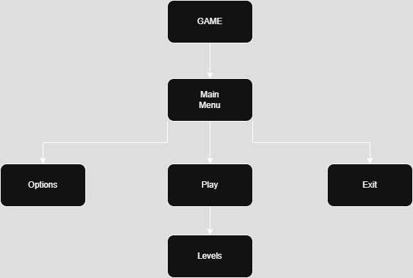

# MDS

## Descriere
Proiectul dezvoltat de echipa noastra este un joc in Unity. Jocul este de tip factory building, ce are ca scop taierea unor blocuri de tip matrice 3x3, ce trebuie sa ajunga la destinatia dorita pentru a termina misiunea.

## Autori
- **Lupu Andrei**
- **Moise Andrei**
- **Buhnia Tudor**
- **Voinea Ionut-Florin**

## JIRA
https://ogquad.atlassian.net/jira/software/projects/SCRUM/boards/1/backlog?selectedIssue=SCRUM-16

## Checkpoint 2
https://docs.google.com/presentation/d/1Qxca-4ycu5Uu8pSQticduQEl5QoC5UI6XlLYDB-UABY/edit?usp=sharing

## Diagrama

## User Stories
# Player
- **User Story: As a player, I want a bug-free game, so that I can enjoy playing it.**
- **Acceptance Criteria: The game runs without critical bugs or crashes during gameplay. No visual glitches or softlocks are present in released levels.**
- **User Story: As a player, I want a tutorial, so that I can understand what i have to do and how to do it.**
- **Acceptance Criteria: The tutorial explains core mechanics, controls, and objectives in a clear, interactive way.**
- **User Story: As a player, I want chill music, so that I can immers myself in the game.**
- **Acceptance Criteria: Background music is relaxing and fits the theme/mood of the game. Music is tested on different levels for consistency and atmosphere.**
- **User Story: As a player, I want the game to be well optimized, so that I won't have crash problems while playing it or lag.**
- **Acceptance Criteria: The game maintains a stable frame rate, no memory leaks or high CPU/GPU usage during normal gameplay. Optimization has been tested on low-to-mid spec machines.**
- **User Story: As a player, I want simple UI, so that I can navigate easyly through game and menu.**
- **Acceptance Criteria: Fonts, icons, and colors are readable and consistent across screens. Buttons and actions are clearly labeled and intuitive.**
- **User Story: As a player, I want many and unique levels, so that I won't feel that the game is boring or repetitive.**
- **Acceptance Criteria: Player testing confirms variety and lack of repetition.**
# Developer
- **User Story: As a developer, I want good communication between team members, so that I can work properly and get feedback of what I did.**
- **Acceptance Criteria: A daily or weekly stand-up meeting is held to share progress and blockers. A shared platform used for updates and feedback.**
- **User Story: As a developer, I want helpful team members, so that I can ask them freely about problems and help me solve them.**
- **Acceptance Criteria: Team members respond to help requests within a reasonable time.**
- **User Story: As a developer, I want team members with good imagination, so that I can ask them for ideas to new things I can add.**
- **Acceptance Criteria: Regular ideation meetings are held to propose new game features or polish. All members are encouraged to contribute creative ideas, regardless of role.**
# Manager
- **User Story: As a manager, I want to be able to communicate with the team members, so that I can better report our team progress.**
- **Acceptance Criteria: Developers update task statuses regularly. Manager has access to builds, changelogs, and issue tracking. Progress reports or milestone reviews are scheduled periodically.**

## Design Patterns

In Unity, we structure our entire game loop around core design patterns. One of the main patterns we use is the Prototype pattern, which we implement using Unity prefabs. For example, we have a prefab of a 3x3 square called "Block" that we instantiate repeatedly using the Instantiate() function. This prefab contains a data grid and a movement function, which form the basis for its behavior. Other game objects use this same base, extending or modifying its interaction logic. Additionally, we use Instantiate() for every user placement action, meaning that all movable and placeable objects in the game are created through the Prototype pattern.

## AI usage

When it came to AI, results were a mixed bag—about a 25-75% chance between generating something brilliant or metaphorically shooting ourselves in the foot with a 12-gauge slug. It often misunderstood the code, occasionally overcorrecting perfectly fine snippets, or suggesting overly complex solutions that added layers of confusion rather than clarity. Many ideas looked clever at first glance but ultimately required several frustrating rounds of “decoding” what felt like alphabet soup. That said, when it did work, the output was genuinely impressive—though definitely hit or miss.

A perfect example was our experience with image generation for art prototypes. One team member tried to create a curved sprite for a conveyor belt, but instead got an image of a random middle-aged man sitting in front of what looked like two squiggly lines. It was both hilarious and infuriating.
